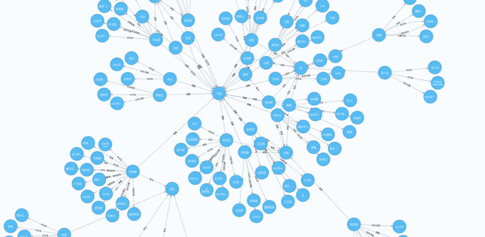

# Knowledge-Graph-0to1
knowledge-graph Note 知识图谱 从0到1  
在实验室工作
可能在下半年就要开始讲解NLP和知识图谱相关了，先想想怎么讲解和带实践项目。

写了几个项目  

基于知识图谱的法律人格ai  

基于知识图谱的四大名著任务关系可视化及QA系统  

基于知识图谱和nlp的智能语言系统  

顺便放一张可视化的图.  

  

以上是我的个人完成的兴趣所致的东西,接下来我是要写的教程,这个的话有领导要求我录制视频...  
我感觉这样会比较麻烦,但是也没办法我只是个小兵啊

|序号|课程|
|:--|:--|
|1|知识图谱概述|
|2|知识表示与建模|
|3|知识抽取与挖掘--术语和实体|
|4|知识抽取与挖掘--关系和事件|
|5|知识图谱的存储和查询|
|6|知识表示学习与推理|
|7|知识图谱应用|
|8|知识图谱遇上深度学习|
|9|知识图谱 深度学习 网络安全|
|10|学术研究 商业化 现状分析|

-----------

本项目可能转为或者移植到private,要求我也没办法,主要就更新`AI2match`和`go-learning-with-hack`这两个项目~~

-----

2019-06-23  
全部都录制成教程了..  收费的.. 不要去买..  太坑了..   
